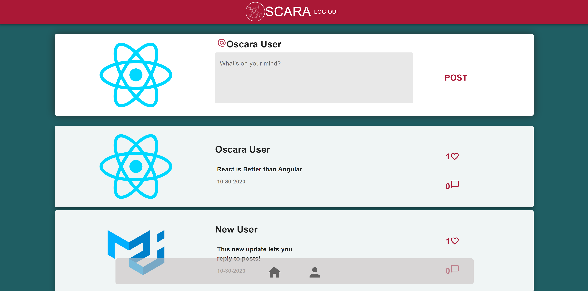
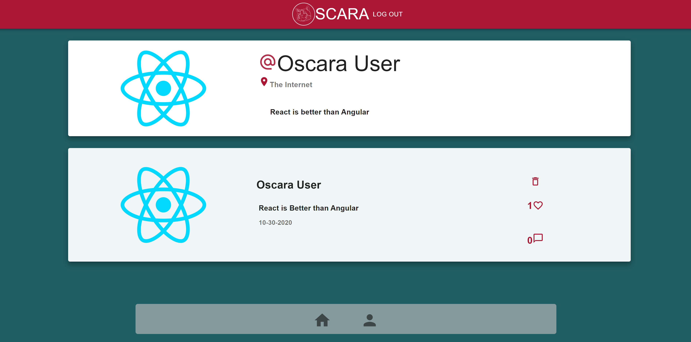

# Oscara: The Social Network

Oscara is my final project for the Rice University Coding Bootcamp. Oscara is a social media website where the user can create a profile with a profile picture, handle, and and other optional info. The can also post status update and like each others posts. Its a great way to explore and connect with anyone online!


### Deployed [Here](https://oscara.herokuapp.com/)

## Usage
To demo this application sign up with an email and password or use these credentials: 
 - example@email.com
 - Password1

After signing up, the user is taken to the sign-up-steps page where they can expect to enter a user handle(required), location(optional), and bio(optional). Then they will be able to upload a profile picture(required) which will be stored in a database. After selecting a photo then the user should click 'upload picture' before pressing the 'add' button. After adding the picture the user has access to the main site which includes their own profile, other user's profiles and the newsfeed by engaging with transparent nav bar at the bottom. The user then can post a up to 240 characters, like and reply to posts. 

** Load more posts feature will be released soon!
## Signup Steps


## Newsfeed


## Profile


## Technologies
 - React/React-Router-Dom
 - Sequelize/mySQL
 - Auth0 for authentication
 - Material UI
 - JSON Web Tokens
 - Multer for uploading profile pictures
 - Sharp for image compression
 - Service Worker, Manifest, and Code Splitting

## Database
Sequelize is used throughout this project. While it is not needed, the sequelize cli is very useful for setting up your local development environment:

```
npm i -g sequelize-cli
sequelize db:create
```

Sequelize is configured to run from the config/config.js which needs the following environment variables set:

```
DB_USERNAME=
DB_PASSWORD=
DB_NAME=
```


## Starting the app locally
Start by installing front and backend dependencies. While in this directory, run the following command:

```
npm install
```

This should install node modules within the server and the client folder.

After both installations complete, run the following command in your terminal:

```
npm start
```

Your app should now be running on <http://localhost:3000>. The Express server should intercept any AJAX requests from the client.

## Github & Email
    https://github.com/chrscchrn
    cochranschris@gmail.com